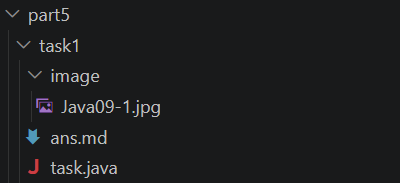
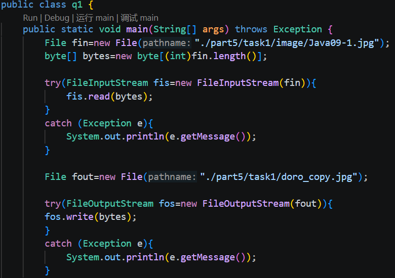
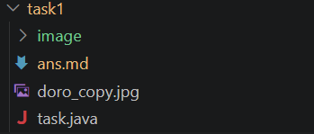
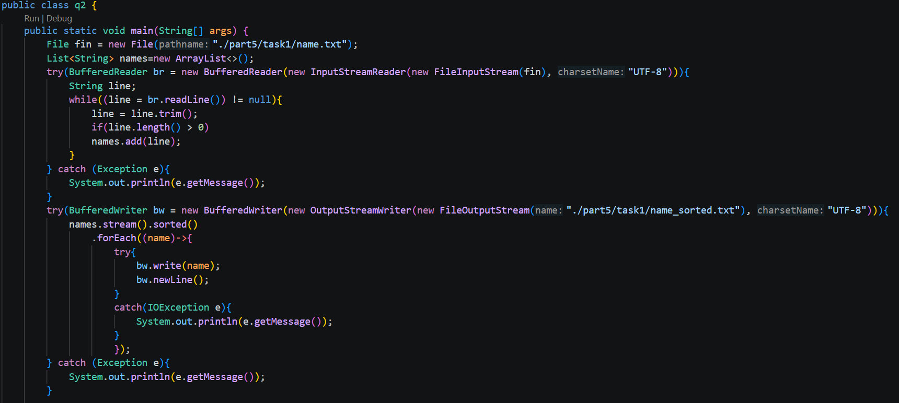
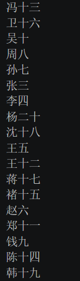

# task1
## ans
### Q1

### Q2

## 问题和思考体会
创建输入流时，文件的地址可能出问题，我用的相对地址，一开始我以为项目根目录是part5，不过运行时我发现项目根目录是part5的上级目录。

当文件地址有问题时，创建输入流会抛出错误，所以要用try-catch结构包起来，创建资源时可以用try-with-resourses结构，这样就不用手动关闭流，try代码运行结束后会自动关闭流。

创建输出流时，如果文件不存在会自动创建，默认情况下新输入的字节会覆盖文件原本的内容，不过可以创建时多输入一个参数，让输出流变成append模式，这样输入的字节会加在原本的内容后面。

做Q2时本来想复习下之前学的Stream流，结果把代码弄得更复杂了，在对names执行终结方法时，使用了lambda函数，它没有声名throws Exception，所以要在方法内部处理异常，最后弄成了嵌套try-catch结构。

嵌套try-catch结构，内层的异常不会自动抛给外层catch结构。

在读取name.txt文件时，文件中有的行没有字符，我一开始以为调用trim（）后，不包含字符的行会是null，写了这样的判断条件``if(line ！= null)names.add(line);``但最后输出的文件里上面有几排空行，后面改成了``if(line.length() > 0)names.add(line);``，后面问了chatgpt，它说现在更常用的写法是``isEmpty（）``和``isBlank（）``。