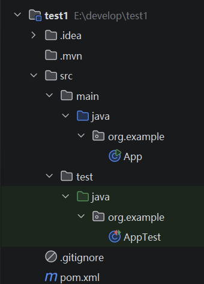
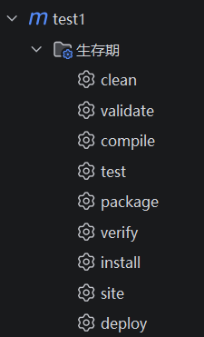

# task3
## ans

- ### 什么是maven？
    1. ##### 什么是maven？
    maven是项目管理和构建自动化工具。
   
    2. ##### 什么是jar包？
    jar包是Java ARchive，通常聚合了大量的java类文件、元数据、资源文件，用于java程序开发。
    
    3. ##### maven和jar包有关系吗？有什么关系？
    maven负责管理jar包。
    
    4. ##### 我们为什么要用maven？
    有许多功能和优势，比如自动管理依赖，只需要在pom.xml文件中声明需要的依赖，maven会自动在本地仓库或者远程仓库下载，并下载jar包本身依赖的其他依赖。还标准化了项目的结构，便于合作开发。并且有丰富的插件，满足开发者的需要。
- ### 什么是maven仓库？
    1. ##### 怎么配置你自己的本地仓库位置？
    找到maven文件夹里的settings.xml文件，在里面修改配置。
    
    2. ##### 需要的jar包本地仓库没有？让我们去看看远程仓库！
    maven在本地仓库没有找到需要的jar包时会从远程仓库下载。
    
    3. ##### 远程仓库不止一种！你知道中央仓库是什么吗？
    中央仓库是maven的默认远程仓库，由某公司维护，包含大多数流行的jar包，是世界上最大的仓库。
    
    4. ##### 私服又是什么？
    私服是公司或团队自己搭建的仓库，供内部人员使用，方便统一管理jar包的版本。
- ### 创建你自己的maven项目！
    1. ##### 你的IDEA关联maven了吗？
    关联了，在`设置`里面的`构建、执行、部署`的`构建工具`里面配置了我下载的maven，还有`用户设置文件`和`本地仓库`。
    
    2. ##### 一个maven项目都需要配置什么参数？你能说说看吗？
    最少需要配置坐标信息；普通的项目还要配置properties、dependencies、build/plugins；多模块项目还要配置parent、modules、dependencymanagement、pluginmanagement；企业级项目还要配置repositories、profiles、发布、元信息等。
    
    3. #####  你的项目结构是什么样的？你知道你的代码、配置文件、测试代码、测试配置文件、maven项目配置文件都在哪里吗？
    
    代码在src/main/java，配置文件在src/main/resources，测试代码在src/test/java，测试配置文件在src/test/resources，Maven项目配置文件是根目录的pom.xml
    
    4. ##### pom.xml文件
        1.  ##### 这是什么？
        项目对象模型。
       
        2.  ##### 它有什么用？
        配置项目的各种信息，包括坐标、依赖、插件、仓库等等。
       
        3.  ##### 它的基本配置有哪些？
        公司名、项目名、版本、项目类型、properties（包括编码格式等）、dependencies（依赖的jar包）。
       
        4.  ##### 你能通过这个文件管理你的jar包版本、项目类型吗？
        可以，jar包版本可以在`<version>`标签里指定，项目类型可以在`<packaging>`里指定。
       
        5.  ##### 怎么导入你需要的jar包？去找到答案吧！
        先找到需要的jar包的坐标信息，然后在pom.xml里面配置信息，之后刷新maven就会自动下载了。
- ### 启动你的maven！
    1. ##### maven的常用命令有哪些你知道吗？
    有clean、compile、test、package、install、deploy，执行某一个命令时，会自动按顺序执行前面的指令。

    2. ##### 图形化界面是非常方便的，去观察IDEA中的maven面板，看看可以快速执行哪些maven指令吧！
    