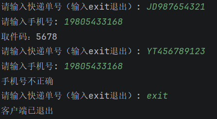

# task4
## ans

## 问题和思考
在做`// TODO 3: 创建HttpURLConnection，把上面的json写入请求体并发送HTTP POST请求`的时候，一开始想在菜鸟教程上找到相关的教程，看一遍之后再做，但是找了很久也没找到讲这个HttpURLConnection的，就直接问ai了，发现两行代码就写完了，看了代码才意识到这个是Java url处理的内容。

写http请求方法的时候写成`Post`了，把报错信息发给ai后，才知道，这个方法名要全部字母大写。

一开始没有写`connection.setDoOutput(true);`后面这行代码就出问题了，`OutputStream os =connection.getOutputStream();`，因为默认情况下，`HttpURLConnection` 默认 `doOutput = false`，表明只是读数据，不往请求体写东西。

写`QueryRequest`和`QueryResponse`这两个类的时候，因为我是直接在构造的时候给对象赋值，代码里没有再给对象赋值，就没有写setter函数，导致fastjson反序列化的时候出问题了，为了排查错误，在服务器端让程序打印出收到的请求体，发现请求没有问题，不知道问题出在哪，最后问了ai才知道是fastjson反序列化的时候需要调用类的setter函数。

